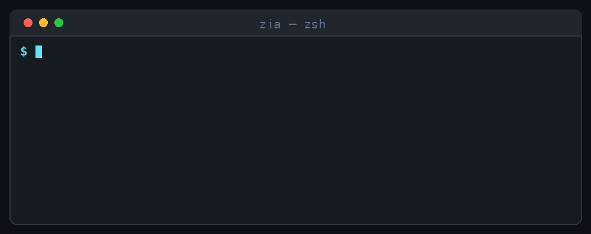

  

<h1 >👋 Hi, I'm Zia Arsalan!</h1>

**`Tech Man`**

I'm a software engineer, and founder at [Devtronics](https://devtronics.co).

  
  
  
  

💳 **Apple Wallet & Google Wallet Specialist** — .pkpass issuance, loyalty & membership passes at scale  

💻 **Full Stack Engineer (MERN)** — React, Node.js, Express, MongoDB & React Native  

🤖 **AI Development & Automation** — LLM integrations, agentic workflows & multi-agent systems  

⚙️ **GoHighLevel Developer** — 3 published marketplace apps, CRM integrations & automations  

📍 **Available for Remote Work | Upwork & Fiverr**

<!-- 

 -->

---

  

<!-- 

  

 -->

## 🔹 **About Me**

I'm a **full-stack engineer** who ships production SaaS, not prototypes — 27 apps live across 10+ countries. Four things I go deep on:

✅ **Apple Wallet & Google Wallet** — .pkpass generation, pass signing, push updates, and white-label loyalty platforms. Nine wallet products shipped, live in Pakistan, the UAE, Saudi Arabia, Qatar and the US.  
✅ **Full Stack (MERN)** — React, Node.js, Express and MongoDB, plus React Native for mobile. Every platform below is built on this stack.  
✅ **AI integration, automation & multi-agent systems** — LLM-powered products with agentic workflows, context memory, escalation logic and CRM hand-off.  
✅ **GoHighLevel** — 3 apps published in the official GHL marketplace, plus custom CRM integrations and automation across Zapier, Make, Pabbly and ManyChat.

I also bring deep experience in **offline-first POS systems** and **IoT device integration** — useful whenever a build has to survive bad connectivity or talk to real hardware.

---

## 🚀 Live Projects

<!-- BEGIN YOUTUBE-CARDS -->

[')](https://www.youtube.com/shorts/ToZWfw3rNro)

<!-- END YOUTUBE-CARDS -->

---

## 💼 **Portfolio Projects**

> **27 production apps** shipped across 10+ countries — 9 Apple/Google Wallet platforms, AI agents, 3 GoHighLevel marketplace apps, fleet systems, and mobile apps.

---

### 💳 Loyalty & Digital Wallet SaaS

<table>
<tr>
<td width="50%" valign="top">

**[LoyalIdeas](https://loyalideas.com/)** &nbsp;🇵🇰 🇦🇪 🇺🇸

White-label loyalty platform where businesses issue digital membership cards via Apple/Google Wallet — no app download needed. Live across 3 countries.

    

</td>
<td width="50%" valign="top">

**[Cardly](https://cardlysa.com/)** &nbsp;🇸🇦

White-label Apple/Google Wallet loyalty platform for the Saudi market with full Arabic/English bilingual support.

    

</td>
</tr>
<tr>
<td width="50%" valign="top">

**[Walaa](https://walaa.com.sa/)** &nbsp;🇸🇦

Apple/Google Wallet loyalty and membership platform deployed in Saudi Arabia — digital card issuance, loyalty workflows, and Arabic-first UX.

    

</td>
<td width="50%" valign="top">

**[Walletly](https://walletly.ai/)**

Digital wallet platform letting businesses manage loyalty passes, digital memberships, and wallet-based transactions for their customers.

    

</td>
</tr>
<tr>
<td width="50%" valign="top">

**WalletCampaigns**

White-label SaaS that lets businesses issue Apple/Google Wallet passes and run targeted push notification campaigns — fully rebrandable for resellers.

    

</td>
<td width="50%" valign="top">

**[LoyaltyJar](https://loyaltyjar.com/)** &nbsp;🇸🇦

Advanced loyalty platform offering modular loyalty programs, Apple/Google Wallet pass issuance, and tailored customer experience solutions.

    

</td>
</tr>
<tr>
<td width="50%" valign="top">

**[WelcomeBack](https://welcomeback.io/)**

Restaurant SaaS combining digital menus, Apple/Google Wallet loyalty passes, online ordering, and automated marketing — all in one platform.

    

</td>
<td width="50%" valign="top">

**[Passport Studio](https://passports.studio/)**

SaaS to design, launch, and manage Apple/Google Wallet passes with scheduled, location-based, and automated push notifications.

    

</td>
</tr>
<tr>
<td width="50%" valign="top">

**[StayLoyal](https://app.stayloyal.net/)** &nbsp;🇶🇦

Loyalty SaaS that lets businesses run digital stamp and rewards programs through Apple/Google Wallet passes — customers stay enrolled without installing an app.

    

</td>
<td width="50%" valign="top">

</td>
</tr>
</table>

 

### 🤖 AI, Automation & Multi-Agent Systems

<table>
<tr>
<td width="50%" valign="top">

**[Recrula](https://recrula.com/)**

AI-powered recruitment SaaS that uses LLMs to automate candidate screening, scoring, and shortlisting.

    

</td>
<td width="50%" valign="top">

**[Meet Gabbi](https://meetgabbi.com/)**

Fully deployed AI support agent handling customer queries end-to-end using LLMs — with escalation logic, context memory, and CRM integration.

    

</td>
</tr>
</table>

 

### ⚙️ GoHighLevel Marketplace

> 3 apps published in the official GHL marketplace, used by agencies across the US.

<table>
<tr>
<td width="33%" valign="top">

**[All the Apps](https://marketplace.gohighlevel.com/integration/683ed93a8ded1a4103d118a2/versions/69df9ea08b8f261b3e2c777a)**

Native GHL integration extending platform functionality for GHL agencies and sub-accounts.

   

</td>
<td width="33%" valign="top">

**[Calendar For CRM](https://marketplace.gohighlevel.com/integration/68516a4c857ac41f0ac67980/versions/68516a4c857ac41f0ac67980)**

Scheduling and calendar management tool built natively for GHL CRM workflows.

   

</td>
<td width="33%" valign="top">

**[Dashboard Tools](https://marketplace.gohighlevel.com/integration/685165a6af8a69551edaefdc/versions/685165a6af8a69551edaefdc)**

Extends GHL with custom dashboards and reporting views for agencies managing multiple sub-accounts.

   

</td>
</tr>
</table>

 

### 🚗 Fleet, Mobility & Transport

<table>
<tr>
<td width="50%" valign="top">

**[DriveIQ](https://drive-iq.ai/)**

Full fleet management SaaS for Amazon Delivery Service Partners — driver dispatch, wave scheduling, real-time scorecards, compliance tracking, and team comms.

    

</td>
<td width="50%" valign="top">

**[Tourdec](https://tourdec.com/)**

Live eBike fleet management system with real-time GPS tracking, booking management, and maintenance scheduling — deployed for a fleet operator.

    

</td>
</tr>
<tr>
<td width="50%" valign="top">

**[The DriveHub](https://thedrivehub.com/)** &nbsp;🇦🇪

Car rental marketplace live across Dubai, Abu Dhabi, and Sharjah — multi-vendor listings, price comparison, booking engine, and transparent rental terms.

    

</td>
<td width="50%" valign="top">

**[Car Rental Platforms](https://rently.pk/)** &nbsp;🇵🇰 🇦🇪 🇺🇸

Car rental platforms deployed across 3 countries — booking engines, payment integrations, fleet management dashboards, and localised UX.

    

</td>
</tr>
</table>

 

### 📱 Mobile Apps

<table>
<tr>
<td width="50%" valign="top">

**[DriveIQ iOS](https://apps.apple.com/us/app/drive-iq/id6772569712)** &nbsp;🇺🇸

Mobile interface for Amazon DSP drivers — check-in, incident reporting with photos, schedule viewing, and team messaging. Live on US App Store.

   

</td>
<td width="50%" valign="top">

**[The DriveHub iOS](https://apps.apple.com/ae/app/the-drive-hub/id6755479169)** &nbsp;🇦🇪

Browse verified rental providers, compare prices, and book cars across Dubai and the UAE. Live on UAE App Store.

   

</td>
</tr>
<tr>
<td width="50%" valign="top">

**[Tourdec iOS](https://apps.apple.com/tm/app/tourdec/id6751212027)**

iPhone companion for the Tourdec eBike fleet platform — ride management, GPS tracking, and operator tools. Live on App Store.

   

</td>
<td width="50%" valign="top">

**[Tourdec Android](https://play.google.com/store/apps/details?id=com.tourdec.app)**

Android companion for the Tourdec eBike fleet platform — ride management, GPS tracking, and operator controls. Live on Google Play.

   

</td>
</tr>
</table>

 

### 🛒 Ecommerce & Business Platforms

<table>
<tr>
<td width="50%" valign="top">

**[MicahGuru](https://micahguru.com/)**

Legal-tech SaaS automating US LLC formation, EIN application, and business bank account setup — serving Pakistani and international founders online.

    

</td>
<td width="50%" valign="top">

**[FlowPOS](https://pos.devtronics.co/)**

Cross-platform desktop POS app built with Electron.js — sales processing, inventory management, and customer tracking that works offline.

    

</td>
</tr>
<tr>
<td width="50%" valign="top">

**[LCT Auto](https://www.lctautollc.com/)** &nbsp;🇺🇸

Car dealership web platform for a Texas-based dealer — vehicle inventory, financing info, and test drive scheduling.

   

</td>
<td width="50%" valign="top">

**[TradexCo](https://tradexco.com.au/)** &nbsp;🇦🇺

Custom sportswear ecommerce platform — team uniforms, club merchandise, and custom jersey ordering with product personalisation.

   

</td>
</tr>
<tr>
<td width="50%" valign="top">

**[Zahra Ebrahim](https://zahraebrahim.com/)**

Fully custom ecommerce platform for a furniture and home decor brand — product catalogue, collections, and full shop experience.

   

</td>
<td width="50%" valign="top">
</td>
</tr>
</table>

---

## 🛠️ **What I Build**

| Area | What that means in production |
| :--- | :--- |
| **Apple & Google Wallet** | .pkpass generation and signing, pass push updates, white-label loyalty and membership platforms |
| **Full Stack (MERN)** | React and React Native on Node.js, Express and MongoDB — REST, GraphQL and WebSocket APIs, JWT/OAuth |
| **AI & Multi-Agent Systems** | LLM integrations, agentic workflows, context memory, escalation logic, and CRM hand-off |
| **GoHighLevel** | Marketplace apps, custom CRM integrations, and automation across Zapier, Make, Pabbly and ManyChat |
| **Offline-First POS** | Desktop point-of-sale with cloud sync, inventory, billing and reporting |
| **IoT & Devices** | Smart breakers and switches over MQTT, WebSockets and REST |

Systems that work offline and online, built for production and complex integrations — with an Upwork and Fiverr track record behind them.

  

---

## 📊 **GitHub Analytics**

  

<!-- 

  

  

 -->

  
  
  
   

---

## 🏆 **Achievements**

  <!--  -->
  

---

## 🎯 **Current Focus**

- 🤖 Multi-agent AI systems & LLM automations for real business workflows
- 💳 Expanding the Apple/Google Wallet product line into new markets
- ⚙️ More GoHighLevel marketplace apps & deeper CRM automation
- 📱 Cross-platform mobile delivery with React Native

---

## 📬 **Let's Connect!**

🌐 **Portfolio**: [ziaarsalan.com](https://ziaarsalan.com/)  
💼 **Upwork**: [ziaarsalan](https://www.upwork.com/freelancers/~0178899ba493a3f67a)  
🧑‍💻 **Fiverr**: [ziaarsalan](https://www.fiverr.com/ziaarsal)

  
  
  

---

  
  ⭐ **If you like my work, consider starring my repositories!**
  
  

